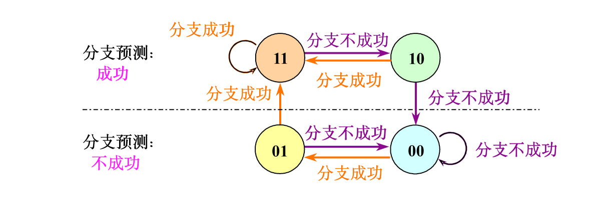
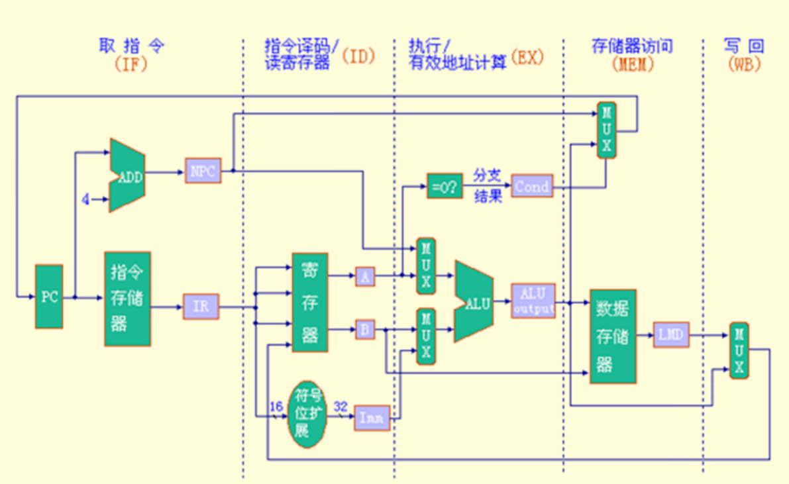
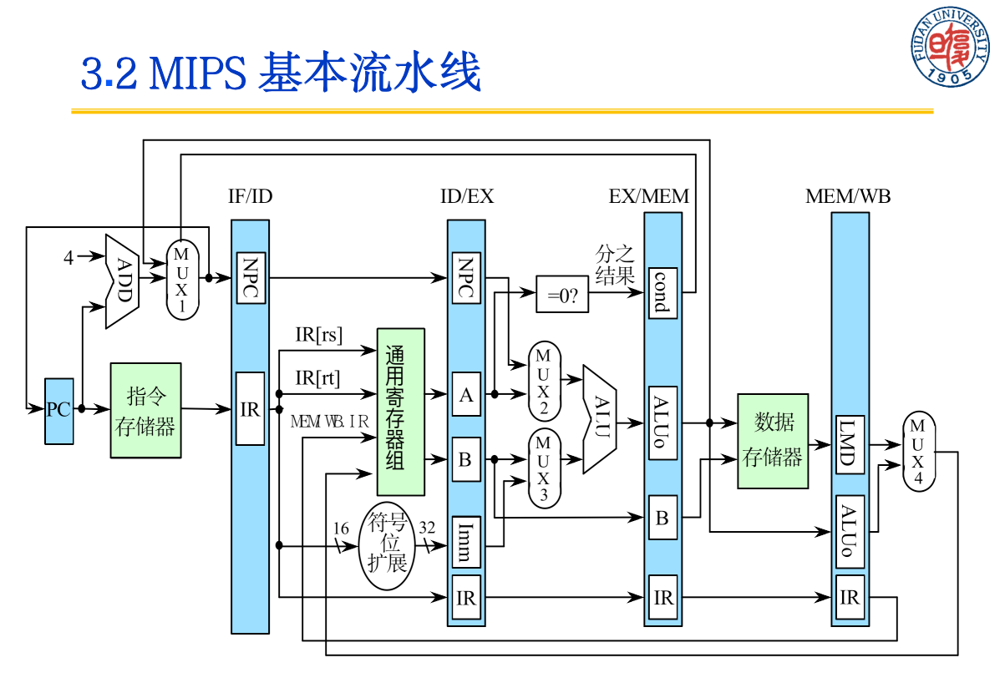
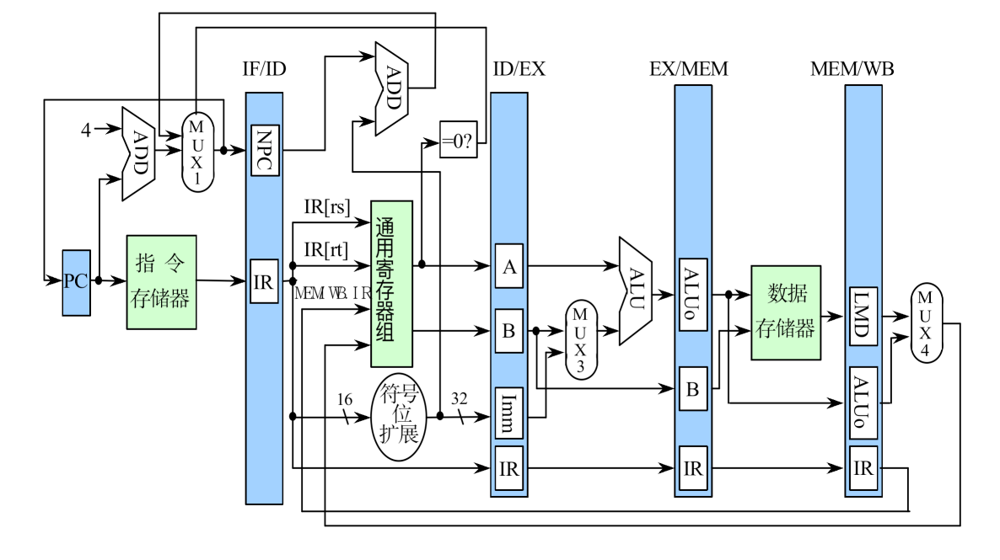
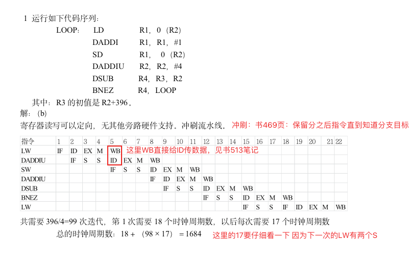
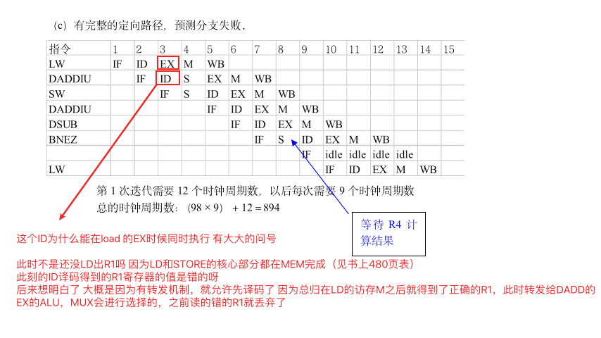
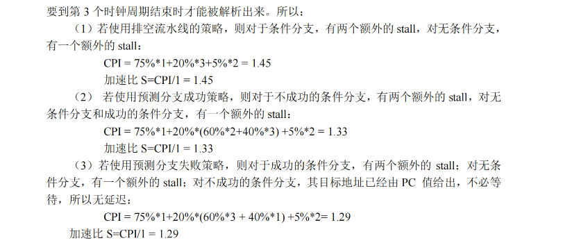

# 第三章 流水线

> 流水线是重点
>
> 概念要看，包括补充的
>
> 流水线重点是静态流水线、动态流水线、线性、非线性、顺序、乱序【概念，要看】
>
> 吞吐率公式等等
>
> **肯定考动态流水线，图一定要画对，会有不同的排序方式，有的排序方式才是最优的**
>
> 五段流水线要理解工作过程，看什么地方会冲突，什么地方会定向
>
> 冒险
>
> **第三章习题2中的题目很容易考，一定要好好理解**

## 分类

流水线的段数就是流水线的深度

流水线分类：        

此外，还分为顺序、乱序；线性、非线性。

## 性能指标

### 吞吐率

$$
TP = \frac{n}{T_k}=\frac{任务数}{完成任务时间}\\ \\
Tk＝kΔt＋(n-1)Δt＝(k＋n-1)Δt \\ \\
n→∞ \ \ \ \  TP_{max} = \frac{1}{△t}
$$
扩展：各段不相等的流水线：

$T_k = 所有段的长度之和+(n-1)个最大的段长度$

                     

这种有瓶颈的流水线可以有两种改进，

- 细分瓶颈段：拆成三个t0，变成每段一样的
- 重复设置瓶颈段：加硬件，变成三个

### 加速比

完成同样一批任务，不使用流水线所用的时间 与使用流水线所用的时间之比。

n个任务，每个分k段：$S=\frac{nk}{k+n-1}$

扩展各段不相等的流水线：

### 效率

 

---

例题：在动态流水线计算吞吐率、加速比、效率

 

现选算法：算4个加法，再算两个乘法，再算一个乘法

先计算A1+B1、A2+B2、A3+B3和A4+B4；再计算(A1+B1)×(A2+B2)和(A3+B3)×(A4+B4)；然后求总的乘积结果。

画出时空图：

 

18个△t 出了7个结果 吞吐率：$7/18△t$

不用流水线：一个不用流水线，由于一次求和需6△t，一次求积需4△t，则产生上述7个结果共需（4×6+3×4）△t = 36△t，加速比为
$$
S=\frac{36\Delta t}{18\Delta t}=2
$$
流水线的效率：算阴影面积和大长方形面积比例

---

动态流水线：

 

算法应该和上一题一样。但是时空图不大一样。

 

## 经典五段流水线

RISC精简指令集的流水线

首先了解没有流水线如何实现：每个指令五个时钟周期

- 取指令周期（IF）
  - IR ← Mem[PC] 。
  - PC值加4。（假设每条指令占4个字节）
  - 从存储器提取当前指令
- 指令译码/读寄存器周期（ID）
  - 译码。
  - 用IR中的寄存器编号去访问通用寄存器组，读出所需的操作数。
  - 确定是否为分支，计算出分支目标地址
- 执行/有效地址计算周期（EX）
  - 根据指令类型执行三条指令之一：
    - 存储器访问指令：ALU把所指定的寄存器的内容与偏移量相加，形成用于访存的有效地址。
    - 寄存器－寄存器ALU指令：ALU按照操作码指定的操作对从通用寄存器组中读取的数据进行运算。
    - 寄存器－立即数ALU指令：ALU按照操作码指定的操作对从通用寄存器组中读取的第一操作数和立即数进行运算。
  - 有效地址计算和执行合二为一是因为：没有指令需要计算数据地址并对数据操作
- 存储器访问／分支完成周期（MEM）
  - load：用上一个周期计算出的有效地址从存储器中读出相应的数据
  - store：把指定的数据写入这个有效地址所指出的存储器单元。
- 写回周期（WB）
  - ALU运算指令和load指令在这个周期把结果数据写入通用寄存器组。
  - ALU运算指令：结果数据来自ALU。
  - load指令：结果数据来自存储器系统。

分支指令需要2个时钟周期（IF+ID）；

store指令需要4个周期（IF+ID+EX+MEM）；

其他指令需要5个周期才能完成。

于是就按这个分段将其流水化：加上流水线寄存器：

 

避免IF段的访存（取指令）与MEM段的访存（读/写数据）发生冲突。可以采用分离的指令存储器和数据存储器；一般采用分离的指令Cache和数据Cache。

ID段和WB段都要访问同一寄存器文件。ID段：读；WB段：写。如何解决对同一寄存器的访问冲突？

ID读寄存器，安排在时钟周期后半段

WB写寄存器，安排在时钟周期前半段

## 流水线冒险

 

结构冒险：stall或加硬件，如Data Cache和指令Cache

数据冒险：转发技术（也称旁路、短路）转发不了的加气泡（停顿）

分支冒险：几种解决策略：预测选中、预测未选中、延迟分支

## 停顿流水线性能

分支预测：降低分支成本

- 静态：编译时低成本预测
- 动态：根据程序特性动态预测

分支预测缓冲区（Branch Prediciton Buffer）或分支历史表BHT（Branch History Table）用BHT来记录分支指令最近一次或几次的执行情况（成功或不成功），并据此进行预测。

类似有限状态机

判定分支是否成功所需的时间大于确定分支目标地址所需的时间。

前述5段经典流水线：**由于判定分支是否成功和计算分支目标地址都是在ID段完成**，所以BHT方法不会给该流水线带来好处。

## 实现流水化

MIPS非流水化实现

流水化实现

改进流水化实现

分支指令的条件测试和分支目标地址计算在EX段完成，对PC的修改在MEM段完成。它所带来的分支延迟是3个时钟周期。

改进（把上述工作提前到ID段进行）

在ID段增设一个加法器，用于计算分支目标地址。

把条件测试“=0？”的逻辑电路移到ID段。

这些结果直接回送到IF段的MUX1。

改进后，分支延迟是1个时钟周期。

---

解决数据冒险的问题 所有的数据冒险均可以在ID段检测到。如果存在数据冒险，就在相应的指令流出ID段之前将之暂停。

完成该工作的硬件称为流水线的互锁机制。 在ID段确定需要什么样的转发（定向），并设置相应的控制。

也可以在使用操作数的那个时钟周期的开始检测冒险和确定必需的转发（定向）。

检测冒险是通过比较寄存器地址是否相等来实现的。

# 习题

## 在动态流水线计算吞吐率、加速比、效率

 

现选算法：算4个加法，再算两个乘法，再算一个乘法

先计算A1+B1、A2+B2、A3+B3和A4+B4；再计算(A1+B1)×(A2+B2)和(A3+B3)×(A4+B4)；然后求总的乘积结果。

画出时空图：

 

18个△t 出了7个结果 吞吐率：$7/18△t$

不用流水线：一个不用流水线，由于一次求和需6△t，一次求积需4△t，则产生上述7个结果共需（4×6+3×4）△t = 36△t，加速比为
$$
S=\frac{36\Delta t}{18\Delta t}=2
$$
流水线的效率：算阴影面积和大长方形面积比例

---

动态流水线：

 

算法应该和上一题一样。但是时空图不大一样。

 

## 由指令画流水线时序表

---

## 算流水化机器的加速比

C.3

题干：原机器无流水，CPI=1，CC=7ns 分成流水线，五个段有各自的时间，最大的2ns，流水线寄存器延迟0.1ns

求：

- 时钟周期时间
- 四条指令一停顿 那么CPI是啥
- 加速比
- 若无限流水级，求加速比

解：

（a）2+0.1=2.1ns 

 （b）CPI=5个周期/4条指令=1.25

​	(c) cpu时间=指令数 * CPI * 时钟周期

​		加速比=单周期CPU时间 / 流水化CPU时间

​					=指令数 * 1 * 7 / 指令数 * 1.25 * 2.1 =2.67

​	(d) 有无限个流水级，忽略停顿，每一级的时间极限为0.1ns

​			加速比=单周期CPU时间 / 流水化CPU时间

​					=指令数 * 1*7 /指令数 * 1*0.1 =70

总结：加了流水线，时钟周期显著减小，但是多了停顿，所以CPI会增大一些，达不到理想的1，算cpu时间要这用两个参数。

---

