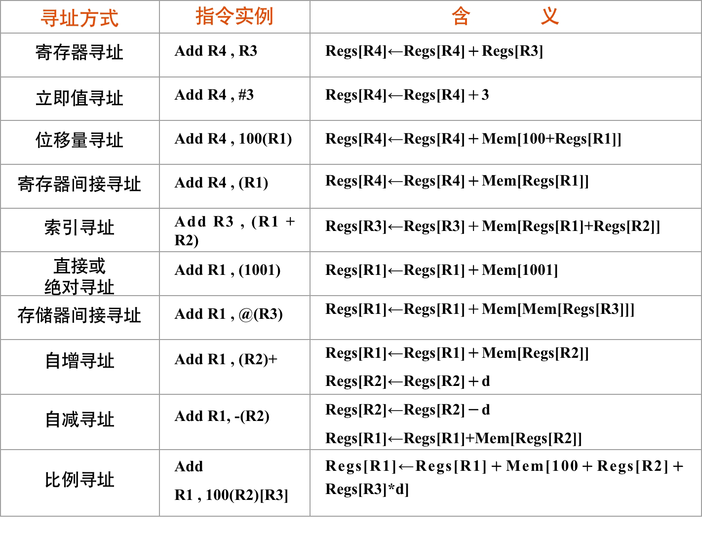
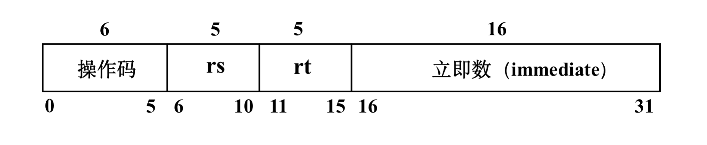
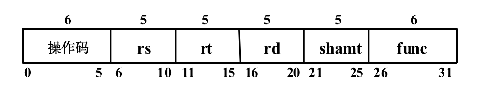
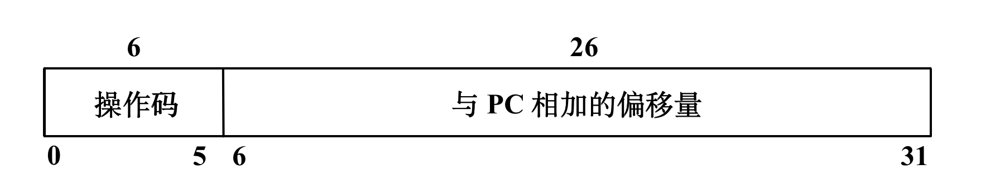
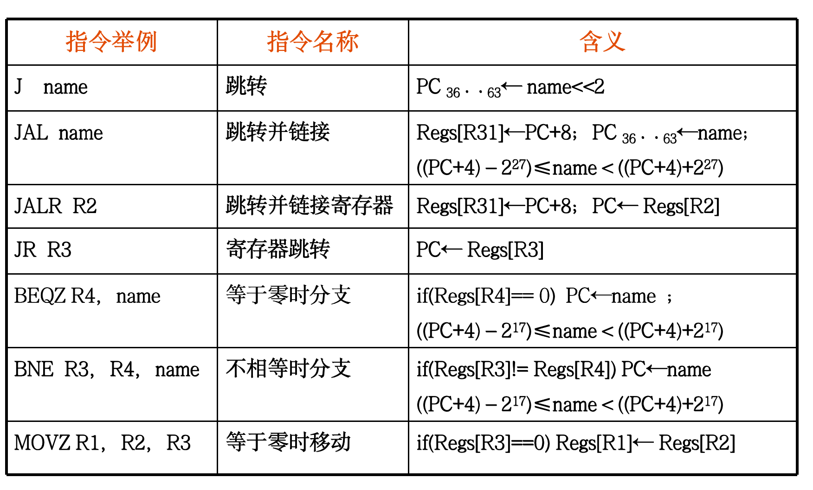

# 第二章 指令集基本原理

不是考试的重点。主要关注的问题有：

- 对各种指令集分类
- 给出一些指令集测试数据进行分析
- 介绍MIPS指令集

## 分类

区分指令集：取决于CPU存储操作数的存储单元的类型

| 存储单元类型 | 指令集类型     |
| ------------ | -------------- |
| 堆栈         | 堆栈结构       |
| 累加器       | 累加器结构     |
| 通用寄存器组 | 通用寄存器结构 |

通用寄存器型指令集结构进一步细分为三种：

- 寄存器-寄存器型（RR型）
  - 也称为load-store结构，这个名称强调：只有load指令和store指令能够访问存储器。
- 寄存器-存储器型（RM型）
- 存储器-存储器型（MM型）
  - 还没有出现在今天交付的计算机中


RR型，计算C=A+B：

```assembly
LOAD R1, A
LOAD R2, B
add R3, R1, R2
store R3, C
```

## 寻址



采用多种寻址方式可以显著地减少程序的指令条数，但可能增加计算机的实现复杂度以及指令的CPI。

立即数寻址方式和位移量寻址方式的使用频度最高。

## MIPS

精简指令集计算机RISC (Reduce Instruction Set Computer)

(1) 简化的指令系统 

​	指令少 / 寻址方式少 / 指令格式少 / 指令长度一致

(2) 以RR方式工作      

​	除Load/Store指令可访问存储器外，其余指令都只访问寄存器。

(3) 指令周期短      

​	以流水线方式工作， 因而除Load/Store指令外，其他简单指令都只需一个或一个不到的时钟周期就可完成。 (4) 采用大量通用寄存器，以减少访存次数 

(5) 采用组合逻辑电路控制，不用或少用微程序控制 

(6) 采用优化的编译系统，力求有效地支持高级语言程序

MIPS是典型的RISC处理器，82年以来新的指令集大多采用RISC体系结构

### 寄存器

MIPS有32个64位通用寄存器（GPRs） R0，R1，…，R31，R0的值永远是0。

此外，32个64位浮点数寄存器（FPRs）F0，F1，...，F31，用来存放32个单精度浮点数（32位），也可以用来存放32个双精度浮点数（64位）。

### 数据类型

整数：字节（8位）、半字（16位）、字（32位）、 双字（64位）

浮点数：单精度浮点数（32位）、双精度浮点数（64位）

字节、半字或者字在装入64位寄存器时，用零扩展或者用符号位扩展来填充该寄存器的剩余部分。

### 寻址

- 立即数寻址  ADD R4, #3
- 位移寻址      ADD R4, 100(R1)

寄存器间接寻址通过将位移字段置0；

16位绝对寻址是通过把R0（其值永远为0）作为基址寄存器来完成的；

所有存储器访问都必须是边界对齐的

### 指令格式

所有的指令长度32位，6位主操作码

I型

load和store指令、立即数指令、分支指令、寄存器跳转指令、寄存器链接跳转指令。



R型

ALU

Regs[rd]← Regs[rs] funct Regs[rt]      func为具体的运算操作编码



J型

跳转

指令字的低26位是偏移量，它与PC值相加形成跳转的地址。



详细字段含义：


### 操作

四大类操作：load和store、ALU操作、分支与跳转、浮点操作

| 指令举例       | 指令名称         | 含 义                                                        |
| -------------- | ---------------- | ------------------------------------------------------------ |
| LD R1，30(R2)  | 装入双字         | Regs[R1]←64 Mem[30+Regs[R2]]                                 |
| LW R1，60(R2)  | 装入字           | Regs[R1]←64 (Mem[60+Regs[R2]]0)32 ## Mem[60+Regs[R2]]        |
| LB R1，40(R3)  | 装入字节         | Regs[R1]←64 (Mem[40+Regs[R3]]0)56 ## Mem[40+Regs[R3]]        |
| LBU R1，40(R3) | 装入无符号字节   | Regs[R1]←64 056 ## Mem[40+Regs[R3]]                          |
| LH R2，30(R3)  | 装入半字         | Regs[R2]←64 (Mem[30+Regs[R3]]0)48 ##Mem[30+Regs[R3]]## Mem[31+Regs[R3]] |
| L.S F2，60(R4) | 装入半字         | Regs[F2]←64 Mem[60+Regs[R4]] ## 032                          |
| L.D F2，40(R3) | 装入双精度浮点数 | Regs[F2]←64 Mem[40+Regs[R3]]                                 |
| SD R4，300(R5) | 保存双字         | Mem[300+Regs[R5]]←64 Regs[R4]                                |
| SW R4，300(R5) | 保存字           | Mem[300+Regs[R5]]←32 Regs[R4]                                |
| S.S F2，40(R2) | 保存单精度浮点数 | Mem[40+Regs[R2]]←32 Regs[F2] 0··31                           |
| SH R5，502(R4) | 保存半字         | Mem[502+Regs[R4]]←16 Regs[R5] 48··.63                        |


| 指令举例           | 指令名称                     | 含义                                              |
| ------------------ | ---------------------------- | ------------------------------------------------- |
| DADDU R1，R2，R3   | 加上无符号数                 | Regs[R1]← Regs[R2]+ Regs[R3]                      |
| DADDIU R4，R5，#3  | 加无符号立即数               | Regs[R4]← Regs[R5]+3                              |
| LUI	R1，#42     | 把立即数装入到一个字的高16位 | Regs[R1]← 032 ##42## 016                          |
| DSLL	R1，R2，#5 | 逻辑左移                     | Regs[R1]← Regs[R2]<<5                             |
| DSLT  R1，R2，R3   | 若小于则置位                 | If(Regs[R2]< Regs[R3])Regs[R1]← 1 else Regs[R1]←0 |




跳转并链接：保存下一跳地址到R31，用于过程调用之后的跳转回来。


MIPS浮点操作由操作码指出操作数是单精度（SP）或双精度（DP）

后缀S：表示操作数是单精度浮点数

后缀D：表示是双精度浮点数浮点操作      

包括加、减、乘、除，分别有单精度和双精度指令。


