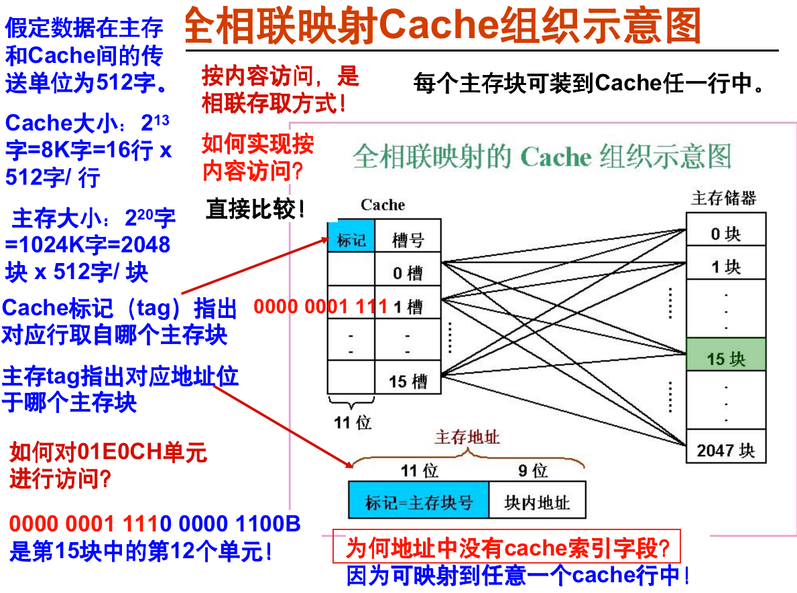
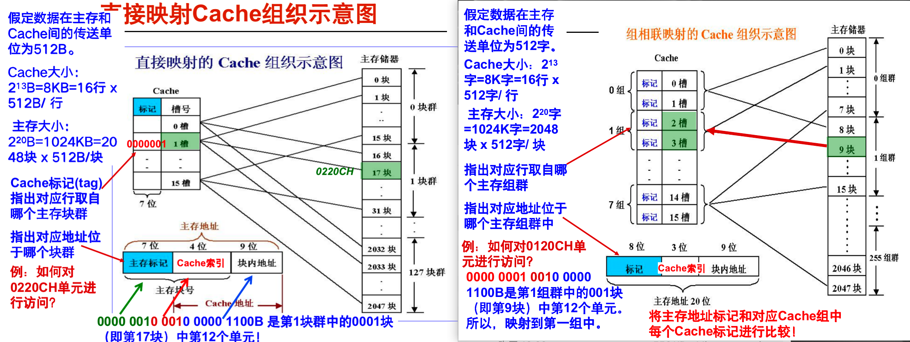
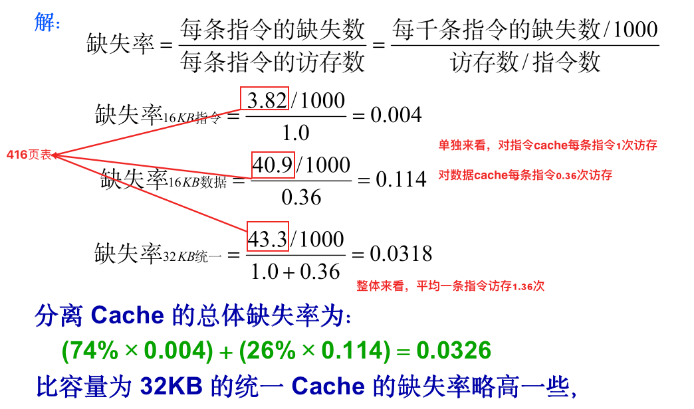
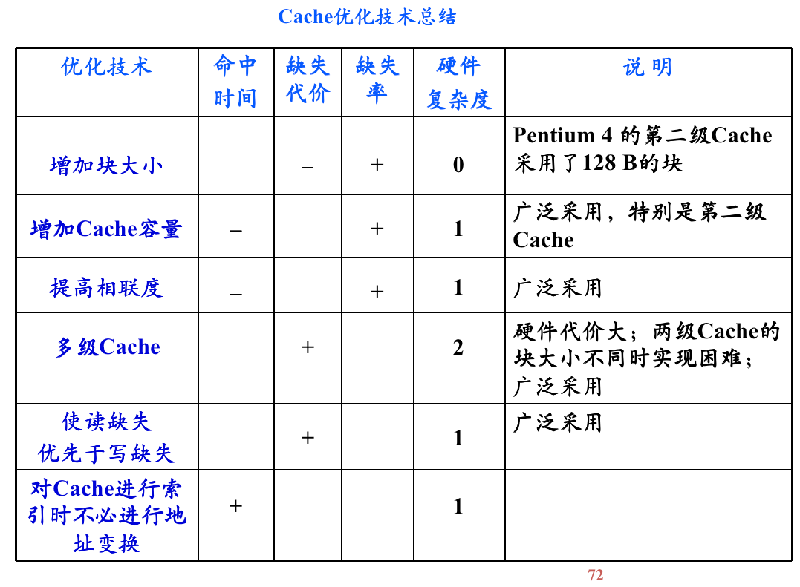
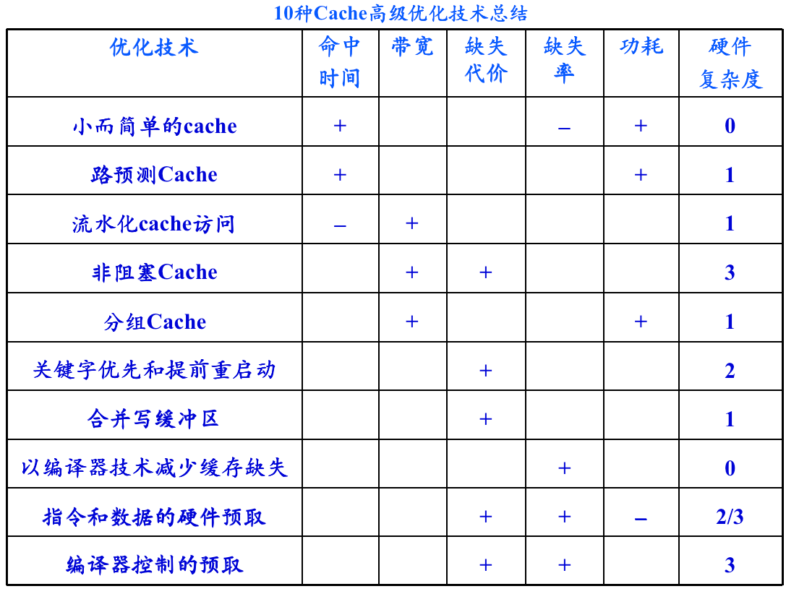

# 第四章 存储器

课堂笔记：https://www.wiz.cn/share-plus/note/73a3beb0-fffa-11eb-a954-2da32e44d85a/92af94ee-5c70-4a9d-9115-87ae7f6fca35

参考：https://zhuanlan.zhihu.com/p/482651908

> 第四章 存储系统
> 出一道大题一道选择题
> 直接映射、组相联、xx相联    【四选一】
> ppt30不考
> **缓存性能分析、命中时间、平均访存时间、失效、CPU执行时间**
> ppt35开始的例题、ppt42
>
> 优化方法要理解
> ppt72 cache优化技术总结
> eg：有哪些方法又会增加缺失率又会降低复杂度
> 10种高级的缓存优化方法
> 知道这种方法达到的目标、基本方法
> 【ppt98】硬件复杂度不用管
> 工作原理不用看

现代处理器一般有三层cache，分别称为L1 cache、L2 cache、L3 cache。**L1 cache**离CPU核最近，存储信息的**读取速度接近CPU核的工作速度**，容量较小，一般分成I-cache和D-cache两块，分别存储指令和数据；L2 cache比L1更远，速度慢一些，但是容量更大，不分I-cache和D-cache；L3更慢、更大，现在流行多核处理器，L3一般由多个处理器核共享，而L1、L2是单核私有的。

cache容量较小，所以**数据需要按照一定的规则从主存映射到cache**。一般把主存和cache分割成一定大小的块，这个块在主存中称为**data block**，在cache中称为**cache line。**举个例子，块大小为1024个字节，那么data block和cache line都是1024个字节。当把主存和cache分割好之后，我们就可以把data block放到cache line中，而这个“放”的规则一般有三种，分别是“**直接映射**”、“**组相联**”和“**全相联**”。

主存地址：块地址 + 块内位移 

块地址：用于查找块在Cache中的位置 查表转化为Cache地址的前半部分，如果表中没有就去主存中调数
块内位移：用于确定访问数据在块内的位置

## 映像规则

---

**直接映射**：直接映射采用“**取模**”的方式进行**一对一**映射。举个例子，如果cache中共有8个cache line，那么0、8、16、24...号data block会被映射到0号cache line中，同理1、9、17....号data block会被映射到1号cache line中，具体可以参考下面的关系图。

“标记”可以显示出当前的cache line对应的是主存中的哪一组data block。举个例子，0、8、16.....号data block都可能存入0号cache line，此时标记位可以显示0号cache line到底是哪个data block。

---

**组相联** ：每个data block对应cache中的一组，具体可以在组中的任何一个位置

相对于直接映射的优点是：如果访问08080808，直接映射可能会频繁换入换出，组相联不会

---

**全相联**：全相联是极端的组相联，即cache只有一个cache set。每一个data block都可以存进任何一个cache line。下图是对应关系。

---

## 查找方法

 在cache中设有一个目录表，该表共有M项，每一项对应于cache中的一个块，用于指出当前该块的信息是哪个主存块的。

### 直接映射

**直接映射的查找细节：**

**计算Cache容量：直接映射**

### 全相联映射

### 组相联映射

特点：结合直接映射和全相联映射的优点。

当Cache组数为1时，变为相联映射；当每组只有一个槽时，变为直接映射。

每组2或4行（称为2-路或4-路组相联）较常用。通常每组4行以上很少用。在较大容量的L2 Cahce和L3 Cahce中使用4-路以上。

和直接映射对比：

结构差不多，可以看到右边是3位cache索引，左面是4位，因为右面分成了一组两个，找的是组

极限情况下，右面只有一组，就没有cache索引了。这也就退化成了我们的全相联映射

## 替换算法

所要解决的问题：当新调入一块，而Cache又已被占满时，替换哪一块？直接映像Cache中的替换很简单，因为只有一个块，别无选择。在组相联和全相联Cache中，则有多个块供选择。

- 随机法
- 先进先出法FIFO
- 最近最少使用法LRU

## 写策略

第二节主要介绍了cache的基本组成方式，电路实现也主要关注数据的读出，除此之外，cache还需要关注“写数据”的问题。

“写数据”关乎到**两种情况**：1、将被改写的数据在cache中；2、将被改写的数据不在cache中。

**针对情况1**，我们又有两种策略来写数据：

1、只改写cache中对应的cache line，这被称为“**写回**”；

2、改写cache line和主存，这被称为“**写穿**”。

第一种策略的**优点是速度快**，因为不用访问速度较慢的主存，缺点是只改写cache的话，cache line和主存中的数据不再一致，这**会产生“一致性”问题**，如果有别的核来访问主存中对应的block，那么它将会读到错误的数据。另外，在cache line被替换出去的时候，数据应该被写进主存，这就要求我们能够辨别哪些cache line是被改写过的，反映在电路上就**需要增加一个“脏”位**，即当一个被标记为脏的cache line被替换出去，那么cache line的内容需要被写入对应的主存。

第二种策略的优点是时刻保持存储器数据一致，缺点是每次store指令都需要访问主存，这个延时代价是高昂的。

**针对情况2，**我们也有两种策略：

1、直接把数据写入主存，此被称为“**写不分配**”；

2、先把data block放进cache line，然后“写回”或是“写穿”，此被称为“**写分配**”。

一般情况下，“写回”和“写分配”组合，“写穿”和“写不分配组合”。**下面两幅图是本节的重点！重点！重点！两幅图依次展示了“写穿”“写不分配”组合的工作流程、“写回”“写分配”组合的工作流程**。

|   操作   |  写不分配+写穿  |   写分配+写回   |
| :------: | :-------------: | :-------------: |
| write100 |     miss+1      | miss+1，调入100 |
| write100 |     miss+1      |      hit+1      |
| read200  | miss+1，调入200 | miss+1，调入200 |
| write200 |      hit+1      |      hit+1      |
| write100 |     miss+1      |      hit+1      |

## 性能分析

对于一个两级的存储，访存，可能命中1级 / 不命中1级

平均访问时间公式：
$$
T_1:一级存储的访问时间\\
T_2:二级存储的访问时间\\
T_B:传送一个信息块的时间\\
命中率：在一级找到信息的概率 \ \ \ \ 
H = \frac{N1}{N1+N2} \ \ \ N代表各级的访问次数\\ \\
缺失率：F=1-H\\
不命中代价：T_M = T_2+T_B\\
命中：访问时间为\ T_1\\
不命中：访问时间为\ T_1+T_2+T_B\\ \\
平均访问时间：T_A = HT_1+(1-H)(T_1+T_M)=T_1+FT_M
$$
CPU执行时间公式：
$$
CPU执行时间＝(CPU执行周期数+存储器停顿周期数)× 时钟周期时间\\
存储器停顿时钟周期数＝缺失次数×缺失代价 \qquad \qquad \qquad \qquad \qquad \qquad \qquad \qquad \qquad \quad \\
存储器停顿时钟周期数＝读的次数×读缺失率×读缺失代价 + 写的次数×写缺失率×写缺失代价\\
存储器停顿时钟周期数＝访存次数×缺失率×缺失代价 \qquad \qquad\qquad\qquad\qquad\qquad\qquad\quad \ \
$$

$$
CPU执行时间＝(CPU执行周期数+缺失次数×缺失代价)× 时钟周期时间\\\\
CPU执行时间==IC×(CPI_{execution}＋每条指令的平均访存次数×缺失率×缺失代价)×时钟周期时间

$$

---

例题：缓存的性能分析

**16KB 指令 Cache 加上 16KB 数据 Cache，与一个 32KB 统一 Cache 相比，哪种缺失率较低？**

**利用表B-3中的缺失率数据，假定36%的指令为数据传输指令。**

**假定一次命中需要1个时钟周期，缺失代价为100个时钟周期。**

**对于统一缓存，如果仅有一个缓存端口，无法同时满足两个请求，一次 load 或 store 操作访问 Cache 的命中时间都要增加一个时钟周期，按照有关流水线的术语，统一Cache会导致结构冒险。**

**又假设采用写直达策略，且有一个写缓冲器，并且忽略写缓冲器引起的等待。请问上述两种情况下平均访存时间各是多少？**

分离Cache平均缺失率 = 访问指令Cache的百分比 × 指令Cache的缺失率＋访问数据Cache的百分比 × 数据Cache的缺失率

访问指令Cache的百分比：100％/(100％＋26％＋10％)≈74％
访问数据Cache的百分比：(26％＋10％)/(100％＋26％＋10％)≈26％
（MIPS存储指令10%，载入指令26%）

指令Cache的缺失率：每条指令的缺失数/每条指令的访存数

存储器平均访问时间＝指令所占的百分比×(指令命中时间＋指令缺失率×缺失代价)＋数据所占的百分比×(数据命中时间＋数据缺失率×缺失代价)

---

例题418页

---

## 基本Cache优化

三种缺失的概念：

- 强制性缺失(Compulsory miss)：当第一次访问a时肯定缺失啊
- 容量缺失(Capacity miss ) ：访问过a了，把a放cache了，因为cache满了，放别的，a被替换了，再访问a
- 冲突缺失(Conflict)：针对组相联和直接映射（就是比较死板的策略）某些组的请求太多了，本来在全相联是没事的，现在你限制了那些数据块只能映射到某些位置，然后就缺失了。

习题：两级Cache，详解见Wiznote

## 高级Cache优化

了解表格即可

